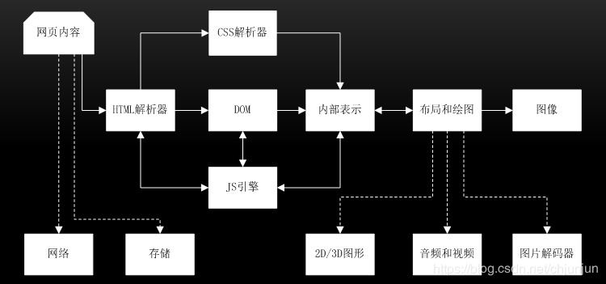

# 关于浏览器以及 js runtime 的一些问题总结

## v8 引擎和 js runtime 什么关系

### V8 引擎
V8引擎应该是我们听到最多的引擎，它使用在 Chrome 浏览器和 Node.js 中。找到一个解释：A JavaScript engine is a program responsible for translating source code into machine code and executing the translation result on a computer's central processing unit(CPU).

常见的引擎有以下：
* [Chrome V8](https://github.com/v8/) : Google Chrome 中使用的引擎。使用 C++ 实现的。Opera,NodeJS 和 Couchbase 都是使用的它。
* [SpiderMonkey](https://developer.mozilla.org/zh-CN/docs/Mozilla/Projects/SpiderMonkey/Releases) : FireFox 使用
* [Nitro(JavascriptCore)](https://trac.webkit.org/wiki/JavaScriptCore) : Safari 使用
* [Chakra Edge](https://github.com/microsoft/ChakraCore) 使用

### js runtime
JS Runtime 就是运行着 JS 引擎的环境，它提供接口给开发者调用。有一些我们经常用到的 API，比如 setTimeout 其实都是属于 window 的，跟 V8 引擎没有任何关系。因此诸如 DOM，Ajax，setTimeout 等方法都是由浏览器提供并实现的，这些可以称为 Web APIs。

### 浏览器内核
浏览器内核主要分成两部分：渲染引擎和 js 引擎。渲染引擎主要是负责 HTML、CSS 以及其他一些东西的渲染，而 JS 引擎则主要负责对 JavaScript 的渲染。但是现在 JS 引擎越来越独立的，基本上所说的内核大多不包含 JS 引擎了。

| 浏览器     | 内核             |                        js 引擎                               |
| ----------|------------------|-------------------------------------------------------------|
|IE -> Edge |trident->EdgeHTML |JScript(IE3.0-IE8.0)/Chakra(IE9+之后）                        |
|Chrome     |webkit->blink     |V8                                                           |
|Safari     |webkit            |Nitro(4-)                                                    |
|Firefox    |Gecko             |SpiderMonkey(1.0-3.0)/TraceMonkey(3.5-3.6)/JaegerMonkey(4.0-)|
|Opera      |Presto->blink     |Linear A(4.0-6.1)/Linera B(7.0-9.2)/Carakan(10.5-)           |
至于移动端，大部分使用的均为 webkit 这一套，基本兼容 webkit 就 OK。

## 渲染引擎和 JS 引擎的关系

## microtask 和 macrotask
* 一个事件循环(event loop)会有一个或多个任务队列(task queue)，task queue 就是 macrotask queue
* 每一个 event loop 都有一个 microtask queue
* task queue == macrotask queue ！= microtask queue
* 一个任务 task 可以放入 macrotask queue 也可以放入 microtask queue 中
* 当一个 task 被放入队列 queue（macro 或 micro)，那这个 task 就可以被立即执行了

整个 eventloop 基本可以总结为
1. 在 macrotask 队列中执行最早的那个 task，然后移出
2. 执行 microtask 队列中所有可用的任务，然后移出
3. 下一个循环，执行下一个 macrotask 中的任务（再跳到第二步）

### 摘抄一段解释
一个事件循环有一个或者多个任务队列（task queues）。任务队列是 task 的有序列表，这些 task 是以下工作的对应算法：`Events(比如下面的例子中的 click 事件的触发就是 Task)`，Parsing，Callbacks，Using a resource，Reacting to DOM manipulation,setImmediate(setImmediate.js), MessageChannel,window.postMessage，setTimeout,setInterval[等等](https://segmentfault.com/a/1190000008589736)。

每一个任务都来自一个特定的`任务源`（task source）。所有来自一个特定任务源并且属于特定事件循环的任务，通常必须被加入到同一个任务队列中，但是来自不同任务源的任务可能会放在不同的任务队列中。

举个例子，用户代理有一个处理鼠标和键盘事件的任务队列。用户代理可以给这个队列比其他队列多3/4的执行时间，以确保交互的响应而不让其他任务队列饿死（starving），并且不会乱序处理任何一个任务队列的事件。

`每个事件循环`都有一个进入[microtask](https://www.w3.org/TR/html5/webappapis.html#microtask)检查点（performing a microtask checkpoint）的 flag 标志，这个标志初始为 false。它被用来组织反复调用‘进入 microtask 检查点’的算法。总结一下，一个事件循环里有很多个任务队列（task queues）来自不同任务源，每一个任务队列里的任务是严格按照先进先出的顺序执行的，但是不同任务队列的任务的执行顺序是不确定的。按我的理解就是，浏览器会自己调度不同任务队列。网上很多文章会提到 macrotask 这个概念，其实就是指代了标准里阐述的 task。

标准同时还提到了 microtask 的概念，也就是微任务。看一下标准阐述的事件循环的进程模型：
<pre>
1.选择当前要执行的任务队列，选择一个最先进入任务队列的任务，如果`没有任务可以选择(如果任务已经执行完毕，直接跳转到 microtasks 步骤，否则执行第2步)`，则会跳转至 microtask 的执行步骤。
2.将事件循环的当前运行任务设置为已选择的任务。
3.运行任务。
4.将事件循环的当前运行任务设置为 null。
5.将运行完的任务从任务队列中移除。
6.microtasks 步骤：进入 microtask 检查点（performing a microtask checkpoint ）。
7.更新界面渲染。
8.返回第一步。   
</pre>

执行进入 microtask 检查点时，用户代理会执行以下步骤：
<pre>
1.设置进入 microtask 检查点的标志为 true。
2.当事件循环的微任务队列不为空时：选择一个最先进入 microtask 队列的 microtask；设置事件循环的当前运行任务为已选择的 microtask；运行 microtask；设置事件循环的当前运行任务为 null；将运行结束的 microtask 从 microtask 队列中移除。
3.对于相应事件循环的每个环境设置对象（environment settings object）,通知它们哪些 promise 为 rejected。
4.清理 indexedDB 的事务。
5.设置进入 microtask 检查点的标志为 false。    
</pre>

现在我们知道了。在事件循环中，用户代理会不断从`task 队列`中按顺序取 task 执行，每执行完一个 task 都会检查 microtask 队列是否为空（执行完一个 task 的具体标志是`函数执行栈`为空），如果不为空则会一次性执行完所有 microtask。然后再进入下一个循环去 task 队列中取下一个 task 执行...

那么哪些行为属于 task 或者 microtask 呢？标准没有阐述，但各种技术文章总结都如下：
<pre>
macrotasks: script(整体代码), setTimeout, setInterval, setImmediate, I/O, UI rendering
microtasks: process.nextTick, Promises, Object.observe(废弃), MutationObserver
</pre>

关于事件循环还要注意一点,你可以查看[为什么 Vue 使用 MutationObserver 做批量处理？](https://github.com/liangklfangl/react-article-bucket/blob/master/vue/inner-core-concept.md#2%E4%B8%BA%E4%BB%80%E4%B9%88vue%E4%BD%BF%E7%94%A8mutationobserver%E5%81%9A%E6%89%B9%E9%87%8F%E5%A4%84%E7%90%86),即:每次 macrotask 执行完成后会进行 UI 更新，所以**为了使得界面更快更新，我们应该使用 microtask 而不是 macrotask**。

## V8是怎么工作的
在 V8的5.9版本之前，它拥有两个编译器：
* full-codegen —— 一个简单且快速的编译器，可以生成简单但相对较慢的机器码
* Grankshaft —— 一个较复杂的即时优化编译器，可以生成高度优化后的代码

V8 引擎内部的多线程分工：
* 主线程完成你所希望运行的主要内容：获取你书写的代码，编译执行
* 还有一个单独的线程用于编译，以便于主线程可以继续执行，而前者可以在同时进行代码优化
* Profiler 线程，它将通知运行时那些方法花费大量时间，以便于 Grankshaft 可以优化他们
* 一些线程来处理垃圾收集器的扫码

首次执行 JavaScript 代码，V8 利用 full-codegen 直接将解析后的 JavaScript 不经过任何优化，直接编译为机器码。这使它可以非常快速地开始执行机器码。注意，V8不使用中间字节码，因此不需要解释器。当代码运行一段时间后，profiler 线程以及手机来足够的数据来通知运行时应该优化哪个方法。然后，Grankshaft 在另一个线程开始优化。它将 JavaScript 抽象语法树转换为名为 Hydrogen 的高级静态单元分配表示（SSA），并尝试去优化这个 Hydrogen 图。大多数优化在这个层级完成。

### V8引擎所做的优化
[V8引擎中5个优化代码的技巧](https://lyn-ho.github.io/posts/4d26265b/)
