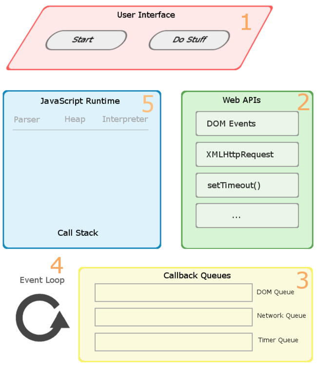

# 关于浏览器的一些概念解释
在交流的过程中经常会遇到一些概念性词语不同人理解不一致，又想不起英文原文是啥，本文主要做这些容易混淆的概念区分。

## 解析器（parser）和解释器（interpreter)

前者是编译器/解释器的重要组成部分，也可以用在 IDE 之类的地方；其主要作用是进行语法分析，提取出句子的结构。广义来说输入一般是程序的源码，输出一般是语法树（syntax tree，也叫 parse tree 等）或抽象语法树（abstract syntax tree）。换一种说法，广义的解析器里一般会有扫描器（scanner， 也叫 tokenizer 或者 lexical analyzer， 词法分析器），以及狭义的解析器（parser， 也叫 syntax analyzer， 语法分析器）。扫描器的输入一般是文本，经过词法分析，输出的是将文本切割的单词的流。狭义的解析器输入是单词的流，经过语法分析，输出是语法树或者精简过的 AST 。

> 在一些编译器/解释器中，解析也可能与后续的语义分析、代码生成或解释执行等步骤融合在一起，不一定会真的构造出完整的语法树，但概念上说解析器就是用来抽取句子结构用的，而语法树就是表示句子结构的方式。

后者则是实现程序执行的一种实现方式，与编译器相对。他直接实现程序源码的语义，输入是程序源码，输出则是执行源码得到的计算结果；编译器的输入与解释器相同，而输出是用别的语言实现了输入源码的语义程序。通常编译器的输入语言比输出语言高级，但不一定；也有输入输出是同种语言的情况辞职编译器很有可能主要用于优化代码。

## JS是解释型语言？
网上很多在讲 python，Ruby，JavaScript 是解释型语言，没有编译行为，都是通过解释器来运行的。这么说至少到现在来说并不是那么准确了。首先语言一般只会定义其抽象语义，而不会强制性要求采用某种实现方式。例如C语言是公认的编译型语言，但是C语言的解释器也是存在的比如 [ch](www.softintegration.com)。同样，C++ 也有解释器版本 [Cint](https://root.cern.ch/cint)。所以一般被称为“编译型语言”的是主流实现为编译器的语言，但不能说他们的所有版本都不能解释器实现，反之“解释型语言”也不一定无法编译。
解释器的输入是源码，输出是程序的执行结果。这个过程对于用户来说没有编译这一个步骤，但是解释器是怎么实现的，解释器是否包含了编译步骤，用户并不关心。其实很多解释器内部都是“编译器 + 虚拟机”的方式来实现的，先通过编译器将源码转换为 AST 或者字节码，然后由虚拟机去完成实际的执行。比如 V8 引擎的实现。也因为此，很多觉得他可以称为混合语言（既有编译又有解释）。个人觉得所谓的解释型语言，并不是没有编译步骤，而只是不需要用户显示的使用编译器去的到可行执行代码而已。

### VM （虚拟机）
在不同场合虚拟机拥有不同含义。如果是在 Java、Python 这类语言中，那么一般指的是高级语言虚拟机（high-level language virtual machine， HLL VM），其意义是实现高级语言的语义。 一般是满足某种指令集架构（Instruction set architecture，ISA）的指令序列，中间转换为目标ISA的指令序列并加以执行，输出位程序的执行结果的，就是 VM。而编译和解释实现虚拟机最大的区别可能就在于是否存下目标代码，编译的话会把输入的源程序以某种能被底层系统直接执行的形式（一般就是 native code），然后在执行。如果采用解释方式，VM 基本就是对输入的指令逐条直接执行。

### V8 JIT
JIT （just-in-time）在很多语言中都存在，比如Java就存在一些在执行前编译代码的机制。而 V8 在引入了 JIT 之后运行效率也得到了很大的提升。
```
for (int i = 0; i< 10000; i++) 
    sum += i;
```
以上代码如果用常规的解释型语言的虚拟机去执行的话就是，重复 1W 遍去执行`sum += i`这条命令。而编译型语言会把它编译成能更快执行的中间码，或者直接使用机器码。这样相同的代码，执行效率就会有很大的差距。
而 JIT 就是为了优化上述情况，在一段代码运行了一次之后，那么就称为warm。当一个函数变得 warm 之后，JIT 将会把这段代码送到编译器中编译并进行保存，当下一次执行同样的代码的时候，引擎就会跳过翻译过程直接使用编译后的版本。如果这段代码被执行了更多次，变得 hot 或者 hotter。 JIT 就会尝试更多的优化并且保存优化后的版本。在编译器进行优化的过程中会做一些关于变量类型和环境中值的假设；但是如果假设不成立就将这个优化的版本回退，如果假设成立的话，这将让代码的性能更高。
关于 JIT 的更多描述可以查看[A crash course in just-in-time(JIT) compilers](https://hacks.mozilla.org/2017/02/a-crash-course-in-just-in-time-jit-compilers/)

## DOM 和 CSSOM

浏览器在渲染页面之前需要先构建 DOM 和 CSSOM 树。这两个树各自构建，没有相互的依赖。

* 字节 -> 字符 -> 令牌（token) -> 节点 -> 对象模型
* HTML 标记转换成文档对象模型（DOM）； CSS 标记转换成 CSS 对象模型（CSSOM）
* DOM 和 CSSOM 是独立的数据结构
* Chrome DevTools Timeline 让我们可以捕获和检查 DOM 和 CSSOM 的构建和处理开销

CSSOM 树和 DOM 树合并成渲染树，然后用于计算每个可见元素的布局，并输出给绘制流程，将像素渲染到屏幕上。

* DOM 树与 CSSOM 树合并后形成渲染树。
* 渲染树只包含渲染网页所需的节点（display：none 的节点不在渲染树上）
* 布局计算每个对象的精确位置和大小
* 最后一步是绘制，使用最终渲染树将像素渲染到屏幕上。

从下面图片中我们可以看到 CSSOM 和 DOM 虽然有着相似的树结构，但是他们是完全不同作用的两颗树， CSSOM 更多的作为一套树形规则，从根节点往下匹配， DOM 依据这套规则来给每个节点增加样式形成渲染树。


### 渲染树 （render-tree）
为构建渲染树，浏览器大体上完成了下列工作：
1. 从 DOM 树的根节点开始遍历每个可见节点。
    * 某些节点不可见（例如脚本标记、元标记等），因为它们不会体现在渲染输出中，所以会被忽略。
    * 某些节点通过 CSS 隐藏，因此在渲染树中也会被忽略。
2. 对于每个可见节点，为其找到适配的 CSSOM 规则并应用它们。
3. 发射可见节点，连同其内容和计算的样式。

最后，既然我们知道了哪些节点可见、它们的计算样式以及几何信息，我们可以将这些信息传递给最后一个阶段：将渲染树中的每个节点转换成屏幕上的实际像素。这一步通常称为“绘制”或“栅格化”。
* Layout 事件在时间线中捕获渲染树构建以及位置和尺寸的计算
* 布局完成后，浏览器会立即发出“ Paint Setup ” 和 “ Paint ”事件，将渲染树转换成屏幕上的像素。
上述这个过程随着渲染树的修改会被不断触发。

> 关于 CSSOM 和 DOM 树是否并行生成，标准没有规定，应该取决于浏览器的实现，不过介于他两不会相互影响，应该是可以并行执行的。只是构造渲染树的流程节点会等待这两个 OM 的返回。

> 关于竞态问题，如果浏览器尚未完成 CSSOM 的下载和构建，而我们却想在这个时候执行 js 修改 span 元素的 display 属性，这个时候浏览器将会延迟脚本执行和 DOM 构建，直至其完成 CSSOM 的下载和构建。

### JavaScript 执行和 DOM、CSSOM 的依赖
* 脚本在文档中的位置很重要
* 当浏览器遇到一个 script 标记时， DOM 构建将暂停，直至脚本完成执行。
* JavaScript 可以查询和修改 DOM 和 CSSOM。
* 竞态时，JavaScript 执行将暂停，直至 CSSOM 就绪

> 无论我们使用 <script> 标记还是内联 JavaScript 代码段，您都可以期待两者能够以相同的方式工作。在两种情况下，浏览器都会先暂停并执行脚本，然后才会处理剩余文档。不过，如果是外部 JavaScript 文件，浏览器必须停下来，等待从磁盘、缓存或者远程服务器获取脚本，这就可能给关键渲染路径增加数十至数千毫秒的延迟。这种情况有 async 和 defer 两个关键字帮助优化。

## Web API
客户端的 Web API 是为了扩展 Web 浏览器的功能或者其他的 Http 客户端设计的编程接口。常见的 Web API 一开始都是通过浏览器内置扩展程序实现的，而现在更加倾向于使用 JS binding 来完成。Web API 不是 JS 引擎提供的，而是宿主环境（浏览器）。
Browser Web APIs:浏览器创建的 C++ 实现的线程，其专门用于处理异步时间，如 DOM 事件， http request，setTimeout等。Web APIs 本身无法将执行代码放置到栈中进行执行，每一个 WebAPI 在执行完成以后将回调放入我们的事件队列中。而 Event Loop 就是检查执行栈和时间队列，如果执行栈已经为空，那么将事件队列中的第一个回调函数放到栈中执行。



### JS Binding
在html页面中，我们可以通过JavaScript语句来访问DOM节点，例如document.createElement(“canvas”); 可是document所指向的对象HTMLDocument存在于WebKit中，通过C++实现的，并不存在于JavaScript的引擎中，所以如果想要在web页面中也能通过JavaScript来访问webkit定义的对象，这就需要把WebKit中的对象注入到JavaScript引擎中，而JavaScript引擎中对象的表示方式与WebKit中对象的表示方式存在差别，就需要存在一种方式，把WebKit中的对象转换成JavaScript引擎能识别的对象，这一过程就称为JavaScript Binding。

例如以V8引擎为例，HTMLDocument --> V8HTMLDocument --> v8::Object. 

### JavaScript Binding如何工作？

如果需要把WebKit中实现的DOM对象或HTML5对象暴露给JavaScript，让web开发者在JavaScript中能够访问，就需要在WebKit中为每个对象实现相应的JavaScript Binding文件，以v8引擎为例，我们需要为HTMLDocument对象实现一个V8HTMLDocument的对象，目的是转化HTMLDocument对象为v8::Object。只是WebKit中的DOM对象如此庞大，再加上后续添加的HTML5对象，如果需要为每个对象都亲自完成一个cpp文件实现一个相应的转换类，工作量是可想而知的。WebKit为了解决上述问题，编写了一套工具，可以让WebKit在编译时自动生成相应的binding文件，省去了开发者重复劳动的麻烦。 

在介绍binding工具之前，首先介绍一个Web IDL。Web IDL是W3C Web工作组为了定义Web接口定义的一套标准接口，全称为Web Interface Description Language. 如果浏览器需要实现某项新功能，一般的流程是W3C委员会先讨论该功能，并给出该功能的接口定义，也就是Web IDL，然后各个浏览器厂商来实现该接口，这样就能最大程度的保证各个浏览器的兼容性，才不至于Web开发者采用标准接口开发的Web网页或应用程序只能在某个特定浏览器上运行。
