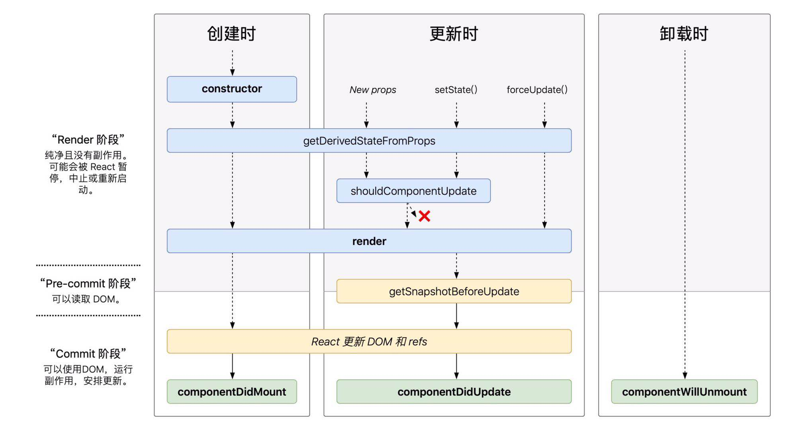

# React Component 生命周期

React Component 可以用 class 和 function 来定义，而通过 extends React.Component 继承的则会拥有 Component 的生命周期,function 定义的 Component(Stateless Component)则只有 render 函数而没有其他生命周期。

* [React.Component](#Component 生命周期示意)
* [Stateless Component](#StatelessComponent)

## Component 生命周期示意


### Mounting（创建时）
在 Component 创建时进行调用的生命周期方法，其中包含了 Component 第一次出现，以及被插入 DOM 中时，会按顺序触发一下方法

* [constructor()](#constructor)
* [static getDerivedStateFromProps()](#static_getDerivedStateFromProps)
* [render()](#render)
* [componentDidMount()](#componentDidMount)

### Updating（更新时）
修改 props 或者 state 造成的 re-render,或者调用[forceUpdate()](#forceUpdate)方法时会调用以下生命周期函数
* [static getDerivedStateFromProps()](#static_getDerivedStateFromProps)
* [shouldComponentUpdate()](#shouldComponentUpdate)
* [render()](#render)
* [getSnapshotBeforeUpdate()](#getSnapshotBeforeUpdate)
* [componentDidUpdate()](#componentDidUpdate)

### Ummounting （卸载时）
从 DOM 上 remove 时会调用
* [componentWillUnmount()](#componentWillUnmount)

## 方法列表

### constructor()
调用时机：当组件第一次被 mounted 时，进行调用。及当 Component 以<Component />形式被加入的时候。

使用方法：一般只在该方法初始化 state 和绑定方法至自身或其他 instance 上

> 1. 当继承自 React.Component 时，必须在所有方法前优先调用 super(props),如果不调用 this.props 将会是 undefined 的
> 2. 使用 this.state = {}方式初始化 state，而不要使用 setState 的方式。
> 3. this.state = { color: props.color},用 props 值给 state 赋值只有在赋默认值时使用，因为后续修改 props.color 将不会反应到 state.color 上，对于 props 中的默认值最好用 default 去描述，并提供另一个不包括 default 描述的参数去强制修改默认值（若有需要的话）

### static_getDerivedStateFromProps()
调用时机：此方法在每次组件变更时，包括创建（constructor 之后）和更新时都会调用。

使用方法：由于该方法拥有两个参数（props， state)，因此该方法适合用于需要依赖之前之后变化的情况,比如过场动画。

> 官网建议了三个替代方案：
> 1. If you need to perform a side effect(for example, data fetching or an animation) in response to a change in props, use   _**componentDidUpdate()**_   lifecycle instead.
> 2. If you want to re-compute some data only when a prop changes,   _**use a memoization helper instead**_  . 
> 3. If you want to "reset" some state when a prop changes, consider either making a component  **_fully controlled_**  or  **_fully uncontrolled with a key_**  instead.

### render()
调用时机：此方法在每次组件变更时，包括创建和更新时都会调用。创建和调用 foreUpdate 时在[static getDerivedStateFromProps()](#static_getDerivedStateFromProps)后调用，new props 和 setState 所造成的更新则会在[shouldComponentUpdate()](#shouldComponentUpdate)后调用，若该方法返回 false，则 render 不会执行。

使用方法：return 你需要展示的内容即可，return 中可包含一下内容：
1. React elements。一般是 JSX，包括不同的 Component 以及 html 标签
2. Arrays and fragments。渲染数组数据，列表等
3. Portals。作为子组件入口渲染，例如：{this.props.children}
4. Booleans or null.可以利用```boolean && <Component/> ```表示<Component /> 是否展示，boolean 本身不会渲染任何内容。可以利用 null 不会渲染任何东西的特性，减少空列表等情况的处理。

> render 尽量只做渲染工作，不要在该方法里修改 setState 的值，如果需要跟浏览器做交互，尽量放在 componentDidMount()或者其他生命周期函数中。

### componentDidMount()
调用时机：在创建时，执行完 render 后，该 Component 会被插入到 react tree 中，成功 mount 后，会触发该方法。

使用方法：这里可以用来从远端获取数据，发起网络请求等，也可以注册一些调用方法，不过需要在 componentWillUnmount()中进行取消。

> 在这个方法里，可以直接调用 setState 方法来改变 state 值，从而触发二次 render，由于 react 机制原因，用户并不会感知到 re-render，只会接受到第二次 render 的结果，如果要减少首屏时间，可以设置默认值，先进行默认页面的展示。

### shouldComponentUpdate()
调用时机：在 setState 或者 new Props 触发的更新时，在[static getDerivedStateFromProps()](#static_getDerivedStateFromProps)后调用。

使用方法：再确认某个 props 或者 state 没有更新则不需要调用 render 时，使该方法返回 false，阻止 render 执行。其默认返回 true。

> 如果是为了提升性能，且在当前 Component 中只要 state 以及 props 没有改变就不需要 render 时，请使用 React.PureComponent,该类不再提供 shouldComponentUpdate()方法，通过该组件自带比较方式确认 state 以及 props 没有发生数值上的更改就会阻止 render 执行。使用 PureComponent 时需保证子组件均为 PureComponent。PureComponent 只进行浅比较（类似基础类型比较），如果包含数组，对象等，可能会被误认为没有改变，这时候也可以使用 forceUpdate 进行强制更新。

### getSnapshotBeforeUpdate()
调用时机：发生在 Component 更新时，无论是 setState，new Props 还是 forceUpdate。

使用方法：该方法有两个参数（prevProps, prevState) ,即变化前的内容，可以在该方法中比较 render 前后的变化，对内容进行微调，比如修改滚动高度等。

### componentDidUpdate()
调用时机：[getSnapshotBeforeUpdate()](#getSnapshotBeforeUpdate)之后。

使用方法：包含三个参数（prevProps, prevState, snapshot),和[componentDidMount()](#componentDidMount)可做的事情基本一致，只不过多了上一个状态的内容，多了判断依据。

### componentWillUnmount()
调用时机：当组件不在被 render 返回，包括父亲节点以上的所有节点。被 remove 的父节点，会递归所有的子孙节点，从叶子节点开始调用所有的组件的 componentWillUnmount()方法。

使用方法：可以在这里取消设置的监听事件，取消异步操作以防止监听回调被调用时，发现当前组件已被销毁。

> 1. 其依赖于 react 事件 diff Dom 树后，关闭浏览器标签，手动修改 url 等操作不会触发该事件，同理相关的无法触发正常移除事件的都不能触发该方法。
> 2. 不应该在该方法中修改 state，因为该 Component 会在方法执行完后 destroy 掉，不会在进行 render。官网原话：Once a component instance is unmounted, it will never be mounted again.


## Stateless Component
先来看一下 babel 解析结果
```
//Stateless Component
const Component = (props) => {
    return <div></div>
}

// babel 解析结果
var Component = function Component(props) {
    return React.createElement('div', null);
}
```
相当于在整个 Component 的构造过程中没有了类对象的组件，而只有简单的 React.createElement 了，因此其并不包含除了 render 以外的所有生命周期函数，但是其本质还是一个 React 组件（应该是因为 JSX 识别为 React 的）。

简单列一下我认为的 Stateless Component 的特征：
1. 代码简洁，基本只包含了需要渲染的东西。
2. 仍然可以传入 props 作为渲染的依据（不需要 this.props，直接 props 即可）
3. 没有 state，无法使用，再简单组件中一般利用 props 重绘即可。
4. 没有 this 指针
5. 由于没有 class Component 的组件内容，渲染性能更优。
