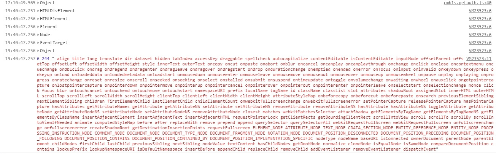

# V-DOM
Virtual DOM (虚拟 DOM ），后续称之为 VDOM ，这个概念并不是 React 独有的，很多前端框架都会利用这个机制去提高渲染能力。因此本文主要介绍为何使用该技术，并简要介绍一下 React 的 VDOM。

## DOM 
理解 VDOM 必定离不开 DOM （Document Object Model），整个网页就是在此之上的一个树状结构，其实就是浏览器中的 document 变量。


每个 DOM 节点都为一个单独的对象，也是 JavaScript 最常需要处理的对象中最重的。

* 超轻量： `Object.create(null)`
* 轻量： 一般的对象 `{}`(Json，VDOM 等)
* 重量： 带有访问器（getter/setter）属性的对象（vue 的 VM）
* 超重量： 各种节点或者 window 对象（DOM）

观察一下一个 DOM 节点有多少的原型链和属性，运行代码如下
```
var proto = 0, attr = 0, str = '';
var div = document.createElement('div'), d = div;
while (d.__proto__) {
  proto++;
  d = d.__proto__;
  console.log(d);
}
for (var key in div) {
  attr ++; str += ' ' + key; 
}
console.log(proto, attr , str);
```
运行结果如下：


6层结构，244个属性，如果 createElement 换成 createTextNode， 5层结构，64个属性仍然很多。
虽然， JavaScript 把对象的属性访问，通过类似 Hash Table 的数据结构进行了保存，访问的复杂度为 O(1)级别的，但是原型链的回溯查找还是需要耗费不少的时间，层次越深，消耗的时间越多，性能自然就越差。
另一个非常耗时的东西就是修改 DOM 会触发浏览器的 restyle/reflow/repaint，这些操作比起 JavaScript 的执行要更加耗时。
但是用 操作 VDOM 替代直接操作 DOM， 最终不还是需要修改 DOM 么，如果使用 innerHTML 是否更加合适。

## innerHTML vs Document.createElement + appendChild

innerHTML： HTML-only，可写入纯文本/ DOM-like , 可执行 script
Document.createElement + appendChild：全部重排/少重拍，可复用节点，以及用 createDocumentFragment

前者是早期更为推崇的 DOM 操作方案，后者则是 React 等框架创建 VDOM 的函数雏形，以及最终执行渲染所用到的API。后者的优点更多，但是在早期却不受用。

## 全部更新到局部更新

最早浏览器网页，每次请求均是正常返回整个HTML，也就是每一次请求都是一个新的页面，很少有 DOM 修改这种操作。但是后面发生了两件大事。
* 2005年，Ajax 技术发扬光大
* 2006年，jQuery 诞生，口号是 Write Less, Do More 的库极大简化和抹平了 DOM 操作。

从此，innerHTML 开始流行，$.html()，成为了最常用来部分刷新页面的操作之一。慢慢的_.templates/ejs/jade/doT 等模板引擎的出现使得，这种操作方法变更更加简单优雅。

VDOM 和 Template 其实本质上都是一种渲染引擎（render engine）的实现方式。
* 有着相同的输入： 标签、语法糖
* 编译： 正则、 AST、 Babel等
* 有着相似的输出： 可传入数据的 render 函数
唯一的差别在于最终 render 函数的输出，是简单的 innerHTML字符串还是 VDOM 树 + diff、patch 的运算逻辑。

## Angular
Angular 在2009年推出，我们在使用 Angular 模板引用数据时，他不仅呈现该数据，还会为该特定值创建一个观察者（watcher）。之后再一些特定时期，Angular 会检查改观察者中的值是否有辩护啊，如果有，则重新渲染 DOM。 运行这些观察者的过程称为脏检查(dirty checking)。
dirty-checking 的设计思路和 VDOM 有些相似，整个机制运行在 JavaScript 层面，在完成之前不会操作 DOM，等数据稳定了之后在进行 DOM 的精准修改。但是什么时候开始计算呢？基本上就是任何事件均需要。
* DOM 事件， 譬如点击（ng-click)
* 地址栏变更（$location)
* XHR 响应（$http）
* 定时器（$timeout/$interval）
* 手动执行（$digest/$apply）

还有就是， DOM 跟 Model 以及 Models 之间， 并没有相对清晰的层级关系，加上其默认的双向数据流。所以它的脏检查的计算过程往往会出现多次计算（digest cycle），其性能瓶颈直接依赖于 watchers 的数量。

## VDOM 算法
简单概括 VDOM 算法，既然直接操作 DOM 很重，那么就用一个 js对象来保存 DOM 的副本， 先操作这个副本（VDOM），再反映到 DOM 上。
1. 用 JavaScript 对象结构表示 DOM 树结构； 然后用这个树构建一个真正的 DOM 树， 查到文档当中。
2. 当状态变更的时候，重新构造一棵新的对象树。然后用新的树和旧的树进行比较，记录两棵树差异
3. 把2所记录的差异应用到步骤1所构建的真正的 DOM 树上，然后视图就随之更新了。

Virtual DOM 本质上就是在 JS 和 DOM 之间做了一个缓存。可以类比内存和硬盘， CPU（js） 直接读取硬盘（DOM）很慢，就先在内存中缓存一份（VDOM），CPU（js)去操作内存(VDOM)，等操作完了，再把差异(diff)写回硬盘(DOM)。
