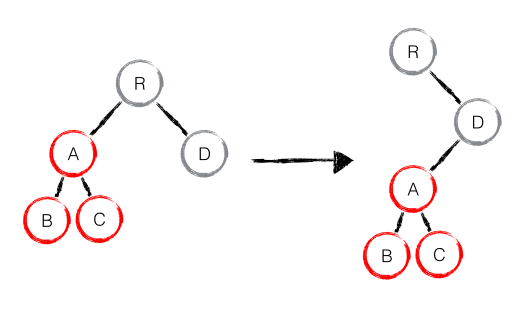
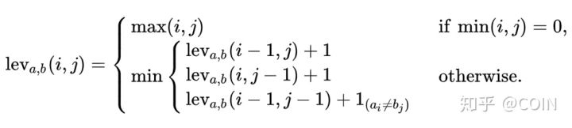
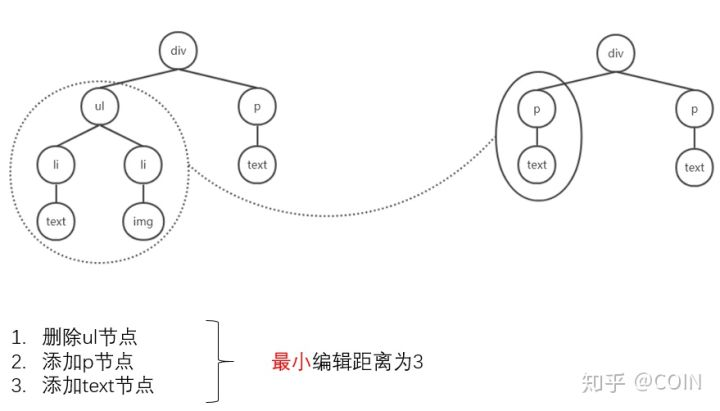
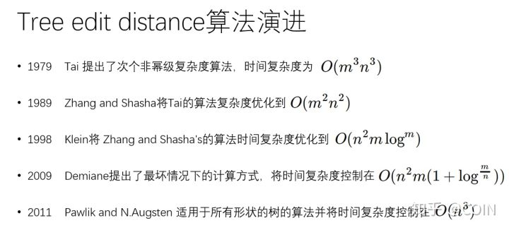
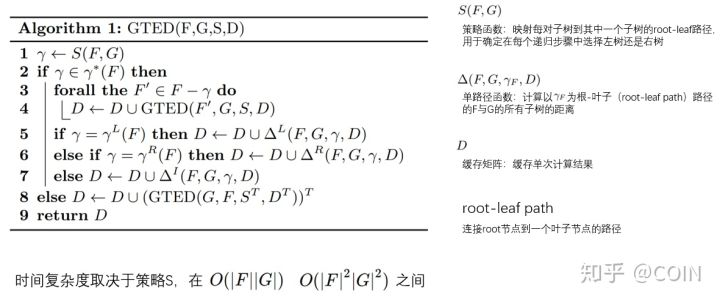
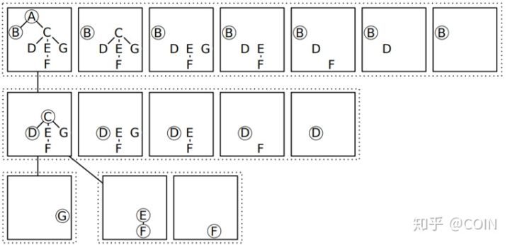
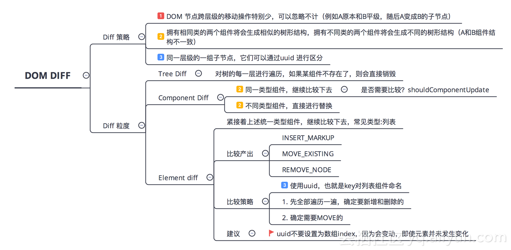
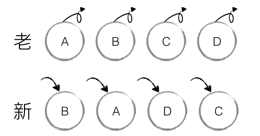
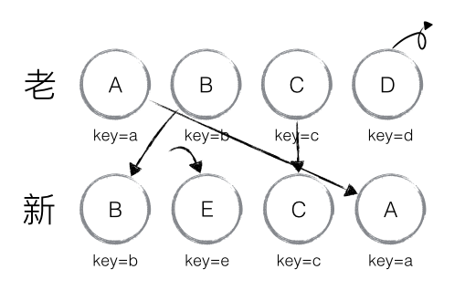

# React Diff
React Diff 作为 React VDOM 的比较算法，算法目的旨在提高两颗 React VDOM 的比较速度，尽快的找出需要变更的 DOM 节点，进行精准的 DOM 树更新，直接操作 DOM 虽然更新更快，但是需要开发人员时刻关注 DOM 的变动，而频繁的来回变动同一个节点明显也是性能的浪费。React VDOM 和 React Diff 就是在手动修改 DOM 的操作复杂性和来回修改 DOM 节点中找到了一个适中且好用的解决方案。

## Diff 算法
Diff 是计算机中很常见的操作，比如 git 中的版本比较也拥有自己的 Diff 算法，那 React Diff 又有什么特殊之处，和一般的 tree diff 又有多大区别呢。

### Same Tree
算法中有一个简单的树遍历算法的应用就是 Same Tree，判断两棵树是否完全相同。算法很简单，无论怎么遍历树，只要有节点不相同就可以得出结果，复杂度为 O(n)。但是如果比较两个树的不同就远远不是这么简单了。

### Diff Tree
如果要比较两棵树有哪些不一样，情况就会比较多，如果树结构相似，如下图，那么看起来好像很简单，找到差异的节点 D 和 G 就可以了。修改也只需要修改这一个节点就可以了。


如果是树的结构的改动，比如下面这个，看起来操作很简单，只需要把子树 A 移动到 D 下即可。但是怎么比较出来下面的差异呢？
1. 首先，如果当它是个二叉树，R 的左子树不一致，差异是缺少了 A 子树
2. 找到 D 的左子树有差异
3. 比较两个 A 子树寻找差异
基本上比较了所有节点，而且这是从我们知道哪里有变动去分析的。



所以比较两个 n 节点的树的差异基本需要比较所有节点的差异，即 O(n^2) 的复杂度。然后还需要计算从一个树变化到另一个树需要的编辑距离。这所有操作的复杂度基本超过 O(n^3)。
如果直接用这种简单粗暴的方式去操作 VDOM 的 Diff 的话，那 100 个节点就有可能面临 1000000 的操作次数，明显是不合理的。

### 最短编辑距离
算法中，动态规划计算字符串 A 到字符串 B 的变化需要最少的操作次数是一个常见案例，这也就是编辑距离，用于描述两者的差异程度。
这种操作一般会包含：替换、插入、删除三种。
比如计算 kitten 与 sitting 的编辑距离
1. kitten -> sitten ( k->s )
2. sitten -> sittin ( e->i )
3. sittin -> sitting ( 插入 g )

三步操作完成字符串变化，因此其编辑距离为3

动态规划方程：


参考： [Edit_distance](https://en.wikipedia.org/wiki/Edit_distance)

### 树的最短编辑距离
树的最短编辑距离，也就是将一棵树变化成另一棵树的最小操作数，不过他的复杂度，远比字符串的比较高得多。

最简单的操作大致如下：



但是大部分情况下，树的比较不会这么简单，可以看下历史上 Tree Edit Distance 算法的演进。用了30年的时间才提升到了O(n^3)。

 

O(n^3) 的算法大致如下:




参考资料：[算法论文](http://vldb.org/pvldb/vol5/p334_mateuszpawlik_vldb2012.pdf)

## React Diff
言归正传，既然直接的 Tree Edit Distance 算法复杂度这么高，致力于高效渲染的 React 肯定不能采用这种方法。通过分析 html DOM 树的特征，React 做了几个假设前提，所有的 Diff 也是基于这些前提进行处理的。

1. Web UI 中 DOM 节点跨层级的移动操作特别少，可以忽略不计。(例如 A 与 B 平级，修改后 A 变为 B 的子节点)
2. 拥有相同类的两个组件将会生成相似的树形结构，拥有不同类的两个组件将会生成不同的树形结构。
3. 对于同一层级的一组子节点，他们可以通过唯一 id ( 例如 uuid ) 进行区分

Diff 算法分为三个维度进行：
1. Tree Diff
2. Component Diff
3. Element Diff



### Tree Diff
基于假设一，React 在进行比较的时候，只对两棵树的同一层级进行比较。React 通过 updateDepth 对 Virtual DOM 树进行层级控制，只会对相同颜色方框内的 DOM 节点进行比较，即同一个父节点下的所有子节点。当发现节点已经不存在，则该节点及其子节点会被完全删除掉，不会用于进一步的比较。这样只需要对树进行一次遍历，便能完成整个 DOM 树的比较。


```
updateChildren: function(nextNestedChildrenElements, transaction, context) {
  updateDepth++;
  var errorThrown = true;
  try {
    this._updateChildren(nextNestedChildrenElements, transaction, context);//递归处理每一层节点
    errorThrown = false;
  } finally {
    updateDepth--;
    if (!updateDepth) {
      if (errorThrown) {
        clearQueue();
      } else {
        processQueue();
      }
    }
  }
}
```
既然 React 的 Diff 只会对同层级的对比，那么如果出现子树的层级移动，React 又会怎么操作呢？回到下面这张图：


这里前后两个 A 子树明显不在同一层级。那这个 A 子树还能从 RL 移到 DL 吗？答案明显是不能的，如果要这么做，Diff 算法至少得先知道 两个 A 子树是一模一样的，只是移动了位置，都这么比较就是 O(n^3) 的策略了。

React 的实际做法：
1. 发现 RL 的 A 消失了，移除 A 节点
2. 发现 DL 多了一个 A 节点，增加 A 节点
3. 发现 A 还有两个子节点 B、C，增加 B、C节点。

所以如果你在操作层级移动时，一定要考虑 React 的真实策略，对 React 来说不是移动，而是删除与新建。React 官方也建议不要进行跨层级的移动操作。

### Component Diff
基于 React Component 的思想，当遇到一个子树为一个 Component 时，会采用 Component Diff 来进行处理，大致策略如下：
1. 如果是同一类型的组件，按照原策略继续往下比较 virtual DOM Tree。
2. 如果不是，则将该组件判断为 Dirty Component，从而替换整个组件下的所有子节点。
3. 对于同一类型的组件，有可能其 Virtual DOM 没有发生任何变化，如果能够确切的知道这点就可以节省整个 Component 的 Diff 时间，因此 React 允许通过 shouldComponentUpdate() 来判断该组件是否需要进行 Diff，从而手动阻止或者跳过，该组件的 Diff 过程。

再回来看这张图，D 和 G 是两个不同的 Component，虽然他们的子树结构完全一样，但是对于 React 来说他们还是不同的 Class，在操作的时候也会对 D 进行直接删除，然后添加 G。


### Element Diff
当节点处于同一层级时，React diff 提供了三种节点操作，分别为：INSERT_MARKUP（插入）、MOVE_EXISTING（移动）和 REMOVE_NODE（删除）。
* INSERT_MARKUP，新的 component 类型不在老集合里， 即是全新的节点，需要对新节点执行插入操作。
* MOVE_EXISTING，在老集合有新 component 类型，且 element 是可更新的类型，generateComponentChildren 已调用 receiveComponent，这种情况下 prevChild=nextChild，就需要做移动操作，可以复用以前的 DOM 节点。
* REMOVE_NODE，老 component 类型，在新集合里也有，但对应的 element 不同则不能直接复用和更新，需要执行删除操作，或者老 component 不在新集合里的，也需要执行删除操作。
```
function enqueueInsertMarkup(parentInst, markup, toIndex) {
  updateQueue.push({
    parentInst: parentInst,
    parentNode: null,
    type: ReactMultiChildUpdateTypes.INSERT_MARKUP,
    markupIndex: markupQueue.push(markup) - 1,
    content: null,
    fromIndex: null,
    toIndex: toIndex,
  });
}

function enqueueMove(parentInst, fromIndex, toIndex) {
  updateQueue.push({
    parentInst: parentInst,
    parentNode: null,
    type: ReactMultiChildUpdateTypes.MOVE_EXISTING,
    markupIndex: null,
    content: null,
    fromIndex: fromIndex,
    toIndex: toIndex,
  });
}

function enqueueRemove(parentInst, fromIndex) {
  updateQueue.push({
    parentInst: parentInst,
    parentNode: null,
    type: ReactMultiChildUpdateTypes.REMOVE_NODE,
    markupIndex: null,
    content: null,
    fromIndex: fromIndex,
    toIndex: null,
  });
}
```
如下图，老集合中包含节点：A、B、C、D，更新后的新集合中包含节点：B、A、D、C，此时新老集合进行 diff 差异化对比，发现 B != A，则创建并插入 B 至新集合，删除老集合 A；以此类推，创建并插入 A、D 和 C，删除 B、C 和 D。




React 发现这类操作繁琐冗余，因为这些都是相同的节点，但由于位置发生变化，导致需要进行繁杂低效的删除、创建操作，其实只要对这些节点进行位置移动即可。

针对这一现象，React 提出优化策略：允许开发者对**同一层级**的同组子节点，添加唯一 key 进行区分，虽然只是小小的改动，性能上却发生了翻天覆地的变化！

新老集合所包含的节点，如下图所示，新老集合进行 diff 差异化对比，通过 key 发现新老集合中的节点都是相同的节点，因此无需进行节点删除和创建，只需要将老集合中节点的位置进行移动，更新为新集合中节点的位置，此时 React 给出的 diff 结果为：B、D 不做任何操作，A、C 进行移动操作，即可。


那么，如此高效的 diff 到底是如何运作的呢？让我们通过源码进行详细分析。

首先对新集合的节点进行循环遍历，for (name in nextChildren)，通过唯一 key 可以判断新老集合中是否存在相同的节点，if (prevChild === nextChild)，如果存在相同节点，则进行移动操作，但在移动前需要将当前节点在老集合中的位置与 lastIndex 进行比较，if (child._mountIndex < lastIndex)，则进行节点移动操作，否则不执行该操作。这是一种顺序优化手段，lastIndex 一直在更新，表示访问过的节点在老集合中最右的位置（即最大的位置），如果新集合中当前访问的节点比 lastIndex 大，说明当前访问节点在老集合中就比上一个节点位置靠后，则该节点不会影响其他节点的位置，因此不用添加到差异队列中，即不执行移动操作，**只有当访问的节点比 lastIndex 小时**，才需要进行移动操作。

以上图为例，可以更为清晰直观的描述 diff 的差异对比过程：

* 从新集合中取得 B，判断老集合中存在相同节点 B，通过对比节点位置判断是否进行移动操作，B 在老集合中的位置 B._mountIndex = 1，此时 lastIndex = 0，不满足 child._mountIndex < lastIndex 的条件，因此不对 B 进行移动操作；更新 lastIndex = Math.max(prevChild._mountIndex, lastIndex)，其中 prevChild._mountIndex 表示 B 在老集合中的位置，则 lastIndex ＝ 1，并将 B 的位置更新为新集合中的位置prevChild._mountIndex = nextIndex，此时新集合中 B._mountIndex = 0，nextIndex++ 进入下一个节点的判断。
* 从新集合中取得 A，判断老集合中存在相同节点 A，通过对比节点位置判断是否进行移动操作，A 在老集合中的位置 A._mountIndex = 0，此时 lastIndex = 1，满足 child._mountIndex < lastIndex的条件，因此对 A 进行移动操作enqueueMove(this, child._mountIndex, toIndex)，其中 toIndex 其实就是 nextIndex，表示 A 需要移动到的位置；更新 lastIndex = Math.max(prevChild._mountIndex, lastIndex)，则 lastIndex ＝ 1，并将 A 的位置更新为新集合中的位置 prevChild._mountIndex = nextIndex，此时新集合中A._mountIndex = 1，nextIndex++ 进入下一个节点的判断。
* 从新集合中取得 D，判断老集合中存在相同节点 D，通过对比节点位置判断是否进行移动操作，D 在老集合中的位置 D._mountIndex = 3，此时 lastIndex = 1，不满足 child._mountIndex < lastIndex的条件，因此不对 D 进行移动操作；更新 lastIndex = Math.max(prevChild._mountIndex, lastIndex)，则 lastIndex ＝ 3，并将 D 的位置更新为新集合中的位置 prevChild._mountIndex = nextIndex，此时新集合中D._mountIndex = 2，nextIndex++ 进入下一个节点的判断。

以上主要分析新老集合中存在相同节点但位置不同时，对节点进行位置移动的情况，如果新集合中有新加入的节点且老集合存在需要删除的节点，那么 React diff 又是如何对比运作的呢？

以下图为例：
* 从新集合中取得 B，判断老集合中存在相同节点 B，由于 B 在老集合中的位置 B._mountIndex = 1，此时lastIndex = 0，因此不对 B 进行移动操作；更新 lastIndex ＝ 1，并将 B 的位置更新为新集合中的位置B._mountIndex = 0，nextIndex++进入下一个节点的判断。
* 从新集合中取得 E，判断老集合中不存在相同节点 E，则创建新节点 E；更新 lastIndex ＝ 1，并将 E 的位置更新为新集合中的位置，nextIndex++进入下一个节点的判断。
* 从新集合中取得 C，判断老集合中存在相同节点 C，由于 C 在老集合中的位置C._mountIndex = 2，lastIndex = 1，此时 C._mountIndex > lastIndex，因此不对 C 进行移动操作；更新 lastIndex ＝ 2，并将 C 的位置更新为新集合中的位置，nextIndex++ 进入下一个节点的判断。
* 从新集合中取得 A，判断老集合中存在相同节点 A，由于 A 在老集合中的位置A._mountIndex = 0，lastIndex = 2，此时 A._mountIndex < lastIndex，因此对 A 进行移动操作；更新 lastIndex ＝ 2，并将 A 的位置更新为新集合中的位置，nextIndex++ 进入下一个节点的判断。
* 当完成新集合中所有节点 diff 时，最后还需要对老集合进行循环遍历，判断是否存在新集合中没有但老集合中仍存在的节点，发现存在这样的节点 D，因此删除节点 D，到此 diff 全部完成。



```
_updateChildren: function(nextNestedChildrenElements, transaction, context) {
  var prevChildren = this._renderedChildren;
  var nextChildren = this._reconcilerUpdateChildren(
    prevChildren, nextNestedChildrenElements, transaction, context
  );
  if (!nextChildren && !prevChildren) {
    return;
  }
  var name;
  var lastIndex = 0;
  var nextIndex = 0;
  for (name in nextChildren) {
    if (!nextChildren.hasOwnProperty(name)) {
      continue;
    }
    var prevChild = prevChildren && prevChildren[name];
    var nextChild = nextChildren[name];
    if (prevChild === nextChild) {
      // 移动节点
      this.moveChild(prevChild, nextIndex, lastIndex);
      lastIndex = Math.max(prevChild._mountIndex, lastIndex);
      prevChild._mountIndex = nextIndex;
    } else {
      if (prevChild) {
        lastIndex = Math.max(prevChild._mountIndex, lastIndex);
        // 删除节点
        this._unmountChild(prevChild);
      }
      // 初始化并创建节点
      this._mountChildAtIndex(
        nextChild, nextIndex, transaction, context
      );
    }
    nextIndex++;
  }
  for (name in prevChildren) {
    if (prevChildren.hasOwnProperty(name) &&
        !(nextChildren && nextChildren.hasOwnProperty(name))) {
      this._unmountChild(prevChildren[name]);
    }
  }
  this._renderedChildren = nextChildren;
},
// 移动节点
moveChild: function(child, toIndex, lastIndex) {
  if (child._mountIndex < lastIndex) {
    this.prepareToManageChildren();
    enqueueMove(this, child._mountIndex, toIndex);
  }
},
// 创建节点
createChild: function(child, mountImage) {
  this.prepareToManageChildren();
  enqueueInsertMarkup(this, mountImage, child._mountIndex);
},
// 删除节点
removeChild: function(child) {
  this.prepareToManageChildren();
  enqueueRemove(this, child._mountIndex);
},

_unmountChild: function(child) {
  this.removeChild(child);
  child._mountIndex = null;
},

_mountChildAtIndex: function(
  child,
  index,
  transaction,
  context) {
  var mountImage = ReactReconciler.mountComponent(
    child,
    transaction,
    this,
    this._nativeContainerInfo,
    context
  );
  child._mountIndex = index;
  this.createChild(child, mountImage);
},
```

当然，React diff 还是存在些许不足与待优化的地方，如下图所示，若新集合的节点更新为：D、A、B、C，与老集合对比只有 D 节点移动，而 A、B、C 仍然保持原有的顺序，理论上 diff 应该只需对 D 执行移动操作，然而由于 D 在老集合的位置是最大的，导致其他节点的 _mountIndex < lastIndex，造成 D 没有执行移动操作，而是 A、B、C 全部移动到 D 节点后面的现象。

在此，读者们可以讨论思考：如何优化上述问题？

建议：在开发过程中，尽量减少类似将最后一个节点移动到列表首部的操作，当节点数量过大或更新操作过于频繁时，在一定程度上会影响 React 的渲染性能。


### 总结

1. React 通过制定大胆的 diff 策略，将 O(n3) 复杂度的问题转换成 O(n) 复杂度的问题；

2. React 通过分层求异的策略，对 tree diff 进行算法优化；

3. React 通过相同类生成相似树形结构，不同类生成不同树形结构的策略，对 component diff 进行算法优化；

4. React 通过设置唯一 key的策略，对 element diff 进行算法优化；

> 建议，在开发组件时，保持稳定的 DOM 结构会有助于性能的提升；

> 建议，在开发过程中，尽量减少类似将最后一个节点移动到列表首部的操作，当节点数量过大或更新操作过于频繁时，在一定程度上会影响 React 的渲染性能。
